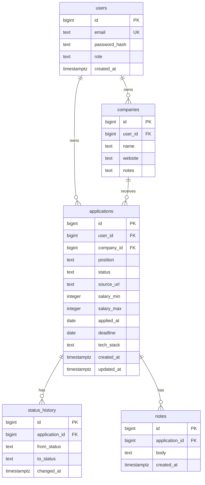

# Database Schema

Initial schema sketch for the Job Application Tracker. This is the design reference — the source of truth once implemented is the Flyway migrations under `backend/src/main/resources/db/migration`.

Database: **PostgreSQL**.

---

## Entity-Relationship Diagram



---

## Tables

### `users`
The authenticated account. Owns companies and applications.

| Column | Type | Constraints | Notes |
|---|---|---|---|
| `id` | `bigint` | PK, identity | |
| `email` | `text` | NOT NULL, UNIQUE | login identifier |
| `password_hash` | `text` | NOT NULL | BCrypt hash |
| `role` | `text` | NOT NULL, default `'USER'` | `USER` / `ADMIN` |
| `created_at` | `timestamptz` | NOT NULL, default `now()` | |

### `companies`
A company the user is applying to. Scoped per user.

| Column | Type | Constraints | Notes |
|---|---|---|---|
| `id` | `bigint` | PK, identity | |
| `user_id` | `bigint` | NOT NULL, FK → `users(id)` | ON DELETE CASCADE |
| `name` | `text` | NOT NULL | |
| `website` | `text` | | |
| `notes` | `text` | | free-form |

### `applications`
The core entity — one job application.

| Column | Type | Constraints | Notes |
|---|---|---|---|
| `id` | `bigint` | PK, identity | |
| `user_id` | `bigint` | NOT NULL, FK → `users(id)` | ON DELETE CASCADE; every query filters by this |
| `company_id` | `bigint` | FK → `companies(id)` | ON DELETE SET NULL |
| `position` | `text` | NOT NULL | job title |
| `status` | `text` | NOT NULL, default `'SAVED'` | see status enum below |
| `source_url` | `text` | | link to the posting |
| `salary_min` | `integer` | | |
| `salary_max` | `integer` | | |
| `applied_at` | `date` | | null while still `SAVED` |
| `deadline` | `date` | | application deadline |
| `tech_stack` | `text` | | comma-separated for now; may become a join table later |
| `created_at` | `timestamptz` | NOT NULL, default `now()` | set on insert (`@CreationTimestamp`) |
| `updated_at` | `timestamptz` | NOT NULL, default `now()` | bumped on every update (`@UpdateTimestamp`) |

### `status_history`
Append-only audit trail — one row per status transition.

| Column | Type | Constraints | Notes |
|---|---|---|---|
| `id` | `bigint` | PK, identity | |
| `application_id` | `bigint` | NOT NULL, FK → `applications(id)` | ON DELETE CASCADE |
| `from_status` | `text` | | null for the initial creation |
| `to_status` | `text` | NOT NULL | |
| `changed_at` | `timestamptz` | NOT NULL, default `now()` | powers "time in status" analytics |

### `notes`
Free-form notes attached to an application.

| Column | Type | Constraints | Notes |
|---|---|---|---|
| `id` | `bigint` | PK, identity | |
| `application_id` | `bigint` | NOT NULL, FK → `applications(id)` | ON DELETE CASCADE |
| `body` | `text` | NOT NULL | |
| `created_at` | `timestamptz` | NOT NULL, default `now()` | |

---

## Status enum

Stored as `text` (JPA `@Enumerated(EnumType.STRING)`), not an ordinal, so reordering never corrupts data.

```
SAVED → APPLIED → SCREENING → INTERVIEW → OFFER
                                        ↘ REJECTED
```

| Status | Meaning |
|---|---|
| `SAVED` | bookmarked, not yet applied |
| `APPLIED` | application submitted |
| `SCREENING` | recruiter / HR screen |
| `INTERVIEW` | technical / on-site rounds |
| `OFFER` | offer received |
| `REJECTED` | rejected or withdrawn (terminal) |

---

## Indexes (planned)

- `users(email)` — unique, for login lookup.
- `applications(user_id)` — every list query is scoped by user.
- `applications(user_id, status)` — Kanban columns and status filters.
- `status_history(application_id)` — timeline lookups.
- `notes(application_id)` — notes per application.

---

## Design notes

- **Ownership everywhere.** `applications` and `companies` carry `user_id`; the API filters by the authenticated user and returns `404` (not `403`) for others' rows so IDs can't be enumerated.
- **Flyway owns the schema.** JPA runs with `ddl-auto: validate`; structural changes go through versioned migrations (`V1__init.sql`, `V2__users_auth.sql`, ...).
- **`status_history` is append-only.** It exists to compute "average time in each status" for the analytics dashboard (Phase 9).
- **`tech_stack` starts denormalized** as comma-separated text; promote to a `tags` / join table only if querying by individual technology becomes necessary.

---

## Implementation status

This document describes the **target** design. It is built incrementally through Flyway migrations, so the live schema is a subset until later phases land.

| Table / column | Migration | Status |
|---|---|---|
| `users` (`id`, `email`, `password_hash`, `created_at`) | `V1__init.sql` | ✅ implemented |
| `applications` (core columns + `created_at`, `updated_at`) | `V1__init.sql` | ✅ implemented |
| `users.role`, unique index on `users.email` | `V2` (Phase 2) | ⏳ planned |
| `applications.user_id` (ownership FK) | `V2` (Phase 2) | ⏳ planned |
| `companies`, `applications.company_id` | later phase | ⏳ planned |
| `status_history` | Phase 5 | ⏳ planned |
| `notes` | later phase | ⏳ planned |

Because ownership (`user_id`) arrives in Phase 2, the Phase 1 `applications` table has **no `user_id` column yet** — the CRUD API is currently unscoped and guarded by a temporary permit-all security config.
